|  | Algorithm and Data Structure |
|--|--|
| NIM |  254107020089|
| Nama |  Christian Nugraha Widyawan |
| Kelas | TI - 1F |
| Repository | [link] (https://github.com/ChristianNugraha06/CHRISTIAN_07_PASD26/new/main/Minggu1) |

# Labs #1 Konsep DASPRO

## 2.1.1. Pemilihan 

Kode terdapat pada Percobaan1.java dan berikut adalah SS hasil programnya

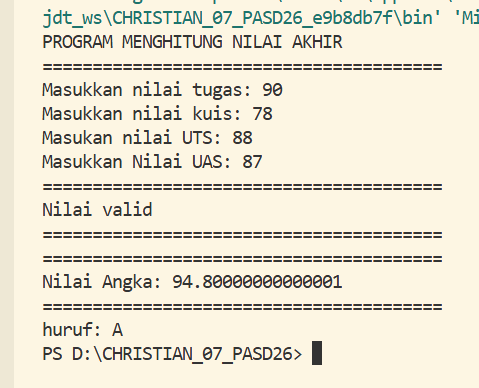

**Penjelasan:** Terdapat 4 langkah yang harus dilakukan 
1. Masukkan semua nilai angka matkul
2. lakukan validasi pada nilai (N>=0||N<=100) 
3. Lakukan perhitungan pada nilai angka yang telah dimasukkan, lalu melakukan konfersi ke nilai huruf
4. Tampilkan status finalnya 

## 2.1.1. Perulangan 

Kode terdapat pada Percobaan2.java dan berikut adalah SS hasil programnya

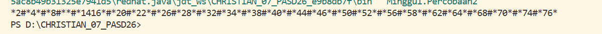

**Penjelasan:** beberapa langkah yang harus dilakukan 
1. Memasukkan nimnya
2. Menginputkan kode sesuai dengan ketentuan yang terdapat pada soal untuk mengubah digit dogit tertentu
3. Perulangan diperlukan untuk mengecek apakah terdapat digit yang sama untuk di ubah kedalam simbol yang ditentukan

## 2.1.1. Array

Kode terdapat pada Percobaan3.java dan berikut adalah SS hasil programnya

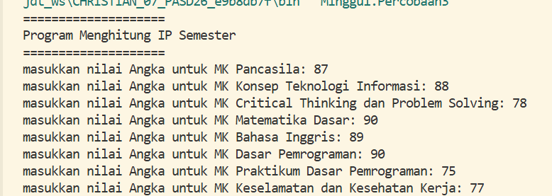 

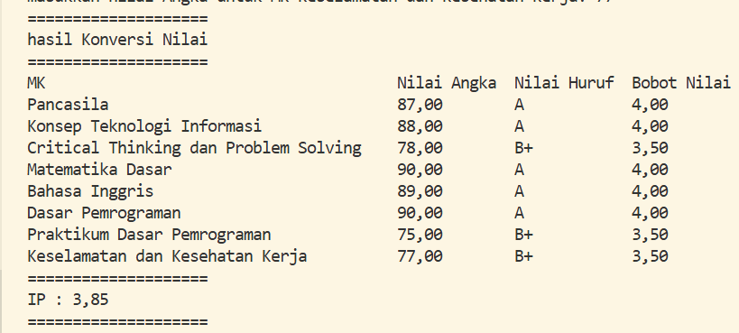 

**Penjelasan:** Beberapa langkah yang harus dilakukan
1. Membuat Array yang berisikan mata kuliah beserta SKSnya
2. Menggunakan Scanner untuk menginputkan nilai angka dari setiap mata kuliah 
3. Melakukan validasi Nilai angka yang dimasukkan (N>=0||N<=100) 
4. Mengkonfersi nilai angka tersebut kedalam nilai huruf, kemudian di konfersi lagi ke bobot nilai atau nilai setara
5. Kemudian mengalikan sks per matkul dengan bobot nilai permatkul kemudian menjumlahkannya, untuk mendapatkan total bobot nilai
6. Menjumlahkan semua SKS permatkul sehingga terdapat total SKS
7. Membagi total bobot nilai dengan total sks
8. Menampilkan hasilnya

## 2.1.1. Fungsi

Kode terdapat pada Percobaan4.java dan berikut adalah SS hasil programnya

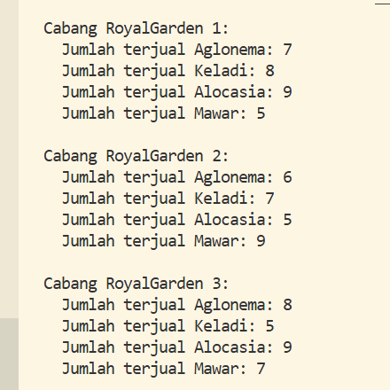

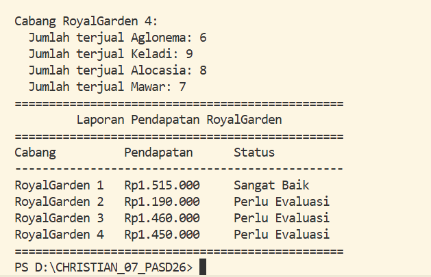 

**Penjelasan:** Beberapa langkah yang harus dilakukan 
1. Membuat Array yang berisikan nama barang, harga, nama cabang,
2. Membuat fungsi untuk menentukan stastus (sangat baik atau perlu evaluasi), serta untuk menghitung pendapatan
3. Melakukan perhitungan menggunakan fungsi fungsi yang sudah di buat
4. Menampilkan hasil perhitungan setiap cabang dan hasil status dari setiap cabang

## 2.1.1. Tugas 1

Kode terdapat pada Tugas1.java dan berikut adalah SS hasil programnya

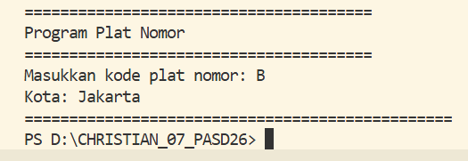

**Penjelasan:** Beberapa langkah yang harus dilakukan 
1. Membuat array dengan tipe data char yang berisi kode kota
2. Membuat array dengan tipe data char yang berisi nama kota 
3. Melakukan input kode kota 
4. Mengecek apakah kode yang di inputkan sesuai dengan nama kota yang ada
5. Menampilkan kode dan kota yang di cari

## 2.1.1. Tugas 2

Kode terdapat pada Tugas2.java dan berikut adalah SS hasil programnya

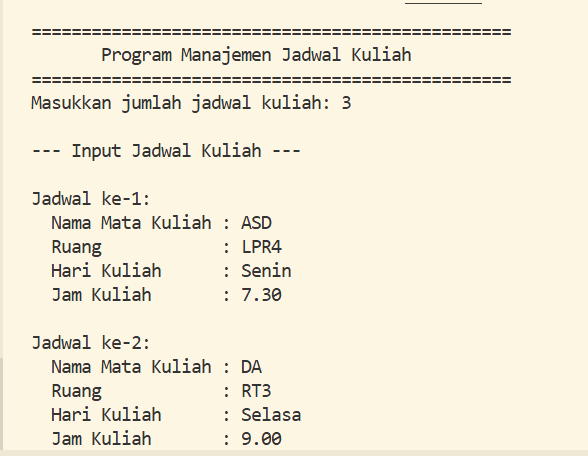

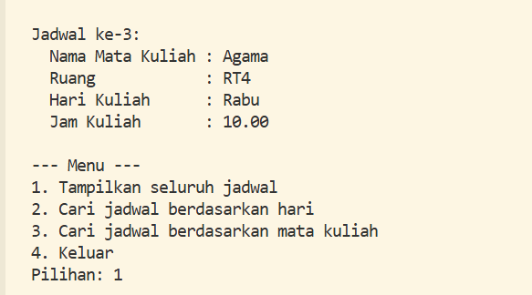

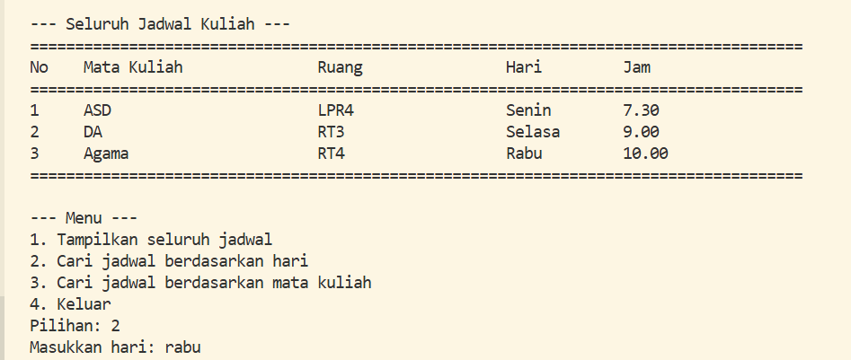

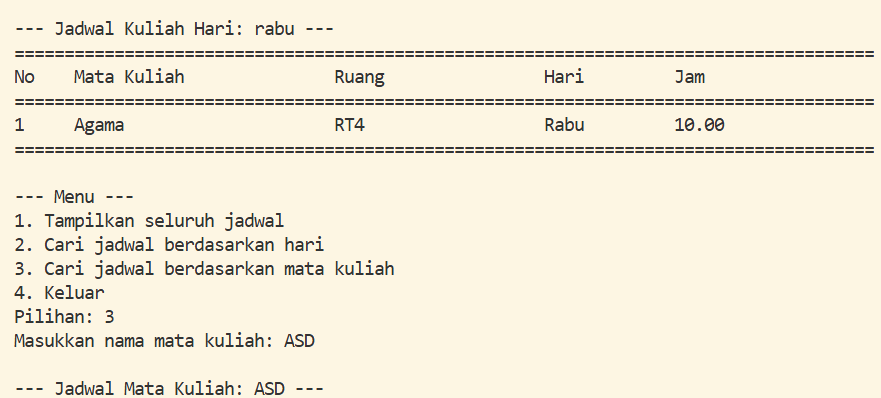

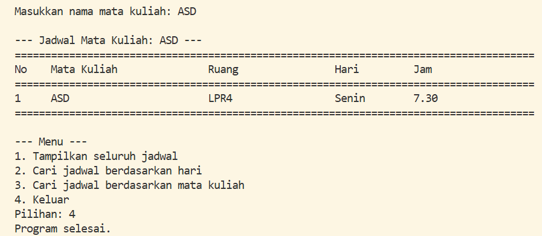

**Penjelasan:** Beberapa langkah yang harus dilakukan 
1. Membuat Array yang bertipe data string, berisi hari,matkul,jam,dan ruangan
2. Membuat input untuk mengisikan hari,matkul,jam,dan ruangan
3. Membuat fungsi menu untuk menentukan mau mencari jadwal melalui apa (hari,matkul,jam,dan ruangan) 
4. Membuat masing masing fungsi sesuai inputan user ingin mencari jadwal melalui apa (hari,matkul,jam,dan ruangan, atau tampilkan semuanya)
5. Menampilkan jadwal ke user 
