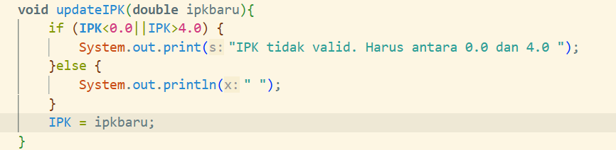
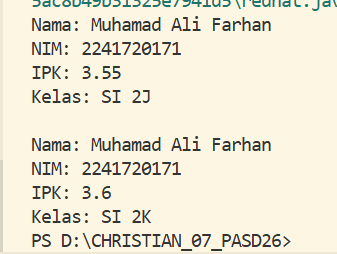
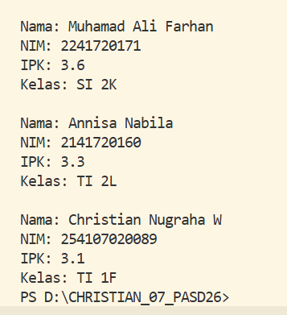

|  | OBJECT |
|--|--|
| NIM |  254107020089|
| Nama |  Christian Nugraha Widyawan |
| Kelas | TI - 1F |
| Repository | [link] (https://github.com/ChristianNugraha06/CHRISTIAN_07_PASD26/new/main/Minggu2) |

# Labs #1 OBJECT

## 1.1.1. Deklarasi Class,Atribut, dan Method

Kode terdapat pada Mahasiswa07.java dan berikut adalah SS hasil programnya

**Penjelasan:** Beberapa langkah yang harus dilakukan
1. Membuat class Mahasiswa07 
2. Memberi atribut pada class tersebut
3. Membuat Method untuk menampilkan informasi, mengubah kelas, mengupdate ipk, dan menilai kinerja

**Jawaban Pertanyaan:**

1. Dua karakteristik class dan objek adalah memiliki atribut dan method 
2. Memiliki 4 atribut, yaitu nama,nim,ipk,dan kelas.
3. Terdapat 4 method yaitu void tampilkan informasi, void ubah Kelas, Void update IPK, dan string nilai kinerja.

4. 

5. Method nilai kerja bekerja dengan memeriksa nilai variabel IPK secara bertahap menggunakan struktur kondisional if-else if-else Method ini akan mengevaluasi kondisi dari atas ke bawah, dan begitu satu kondisi terpenuhi, maka langsung mengembalikan nilai string tertentu tanpa memeriksa kondisi berikutnya.

## 2.2.2 Instansiasi Object, serta Mengakses Atribut dan Method 

Kode terdapat pada MahasiswaMain07.java dan berikut adalah SS hasil programnya

**Penjelasan:** Beberapa langkah yang harus dilakukan
1. Buat fungsi main
2. Buat objek dengan melakukan instansiasi dan mengakses atribut serta method yang ditentukan
3. Menampilkan hasilnya

**Jawaban Pertanyaan:**

1. Mahasiswa mhs1 = new Mahasiswa(); objek yang dihasilkan adalah mhs1
2. Diawali dengan melakukan instansiasi kemudian menuliskan nama objek.nama atribut atau nama objek.nama method
3. Karena terdapat method ubah kelas dan ubah IPK yang membuat hasil method tampilkan informasi satu dan dua berbeda

## 3.3.3 Membuat Konstruktor

Kode terdapat pada MahasiswaMain07.java dan Mahasiswa07.java dan berikut adalah SS hasil programnya

**Penjelasan:** Beberapa langkah yang harus dilakukan
1. Membuat dua konstraktor pada file Mahasiswa07.java yang satu berparameter yang satu tidak
2. Membuat objek baru dengan parameter pada file MahasiswaMain07.java 
3. Mengisi parameter di objek dua 
4. Menampilkan hasilnya

**Jawaban Pertanyaan:**

1. Pada bagian baris 46-54  
public Mahasiswa07(String nm, String nim, double ipk, String kls){
    nama = nm;
    NIM = nim;
    IPK = ipk;
    kelas = kls;
   }
2. Membuat objek 2 bernama mhs2 serta melakukan pengisian pada parameter
3. Program akan eror dikarenakan konstruktor default dibutuhkan oleh objek mhs1
4. Tidak, karena programmer dapat bebas memanggil method mana yang ia perlukan untuk programnya. Namun ketika method saling berhubungan dan ketergantungan, maka urutan pemanggilan perlu di perhatikan.

5. 

## 4. Tugas 1

