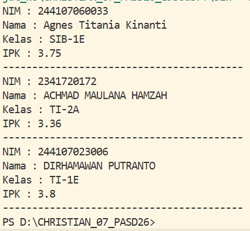
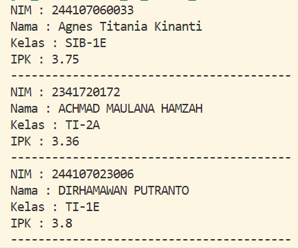
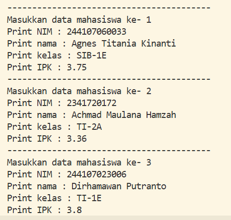

|  | ARRAY OF OBJECT |
|--|--|
| NIM |  254107020089|
| Nama |  Christian Nugraha Widyawan |
| Kelas | TI - 1F |
| Repository | [link] (https://github.com/ChristianNugraha06/CHRISTIAN_07_PASD26/new/main/Minggu3) |

# Labs #1 ARRAY OF OBJECT

## 3.2 Membuat Array dari Object, Mengisi dan Menampilkan

Kode terdapat pada Mahasiswa07.java dan MahasiswaDemo07.java berikut adalah SS hasil programnya

**Penjelasan:** Beberapa langkah yang harus dilakukan
1. Membuat class mahasiswa di file mahasiswa07.java dan mengisikan atribut mahasiswanya
2. Membuat Class mahasiswademo di file mahasiswa yang berisikan fungsi main arrayofmahasiswa dan mengisikan atribut mahasiswa di dalam array tersebut
3. Tampilkan hasilnya, lalu run program tersebut

**Jawaban Pertanyaan:**
1. Class untuk array of object tidak wajib memiliki atribut dan method sekaligus. Namun biasanya kelas memiliki atribut dan method agar sesuai dengan pemodelan objek yang baik
2. Mendeklarasikan Arrayofmahasiswa dengan kapasitas 3 objek mahasiswa
3. Tidak, pemanggilan tetap dapat dilakukan karena Java otomatis menyediakan default constructor, selama tidak ada konstruktor lain yang didefinisikan
4. Melakukan instansiasi dan mengisikan atribut pada mahasiswa ke 0.
5. Peru di pisah karena memiliki tugas yang berbeda, Class mahasiswa berfungsi untuk menyimpan atribut sedangkan yang class mahasiswademo berfungsi sebagai class eksekutor

## 3.3  Menerima Input Isian Array Menggunakan Looping 

Kode terdapat pada MahasiswaDemo07.java dan berikut adalah SS hasil programnya

 

**Penjelasan:** Beberapa langkah yang harus dilakukan
1. Memasukkan Scanner pada program
2. Menambahkan perulangan for 
3. Hasil dari kode program tersebut membuat program dapat memasukkan input manual dari user kerika program dijalankan, dan akan terus berulang hingga batas yang telah ditentukan ( 3 mahasiswa ) karena terdapat perulangan didalamnya

**Jawaban Pertanyaan:**
1. Hasil program sama dengan 
 

kode program dapat dilihat di Mahasiswa07.java dan MahasiswaDemo07.java
2. Kode tersebut error karena menyebabkan NullPointerException karena tidak ada pembuatan objek dalam kode tersebut 

